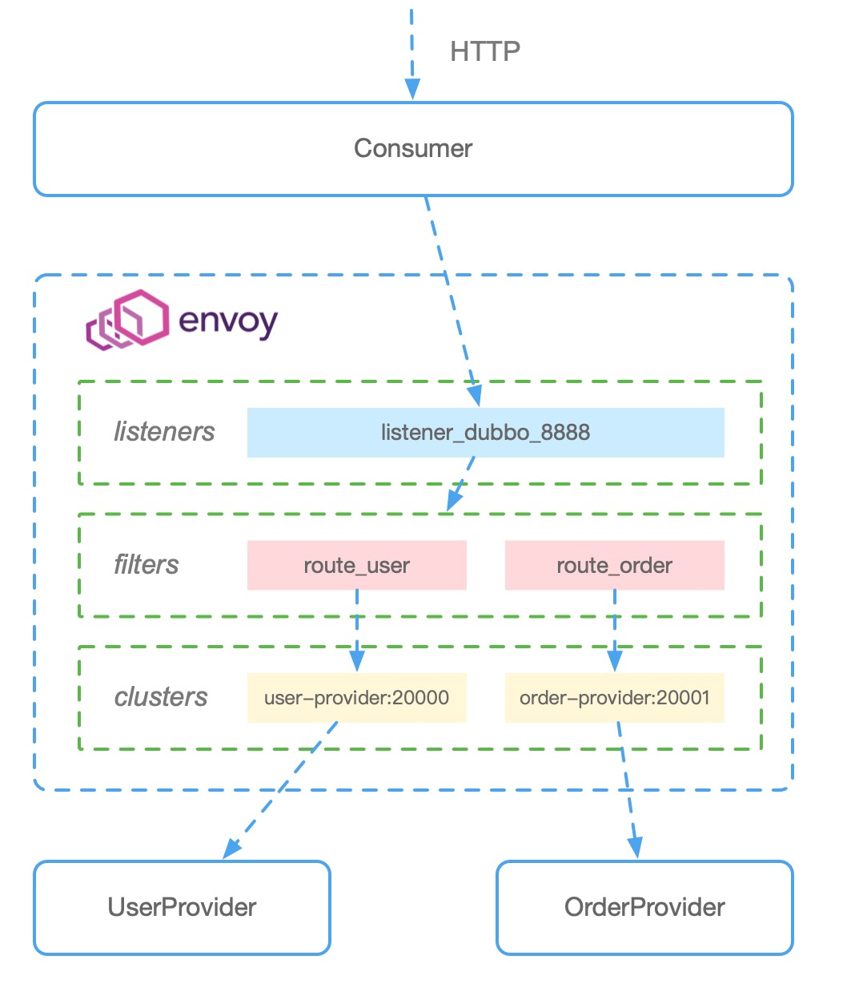
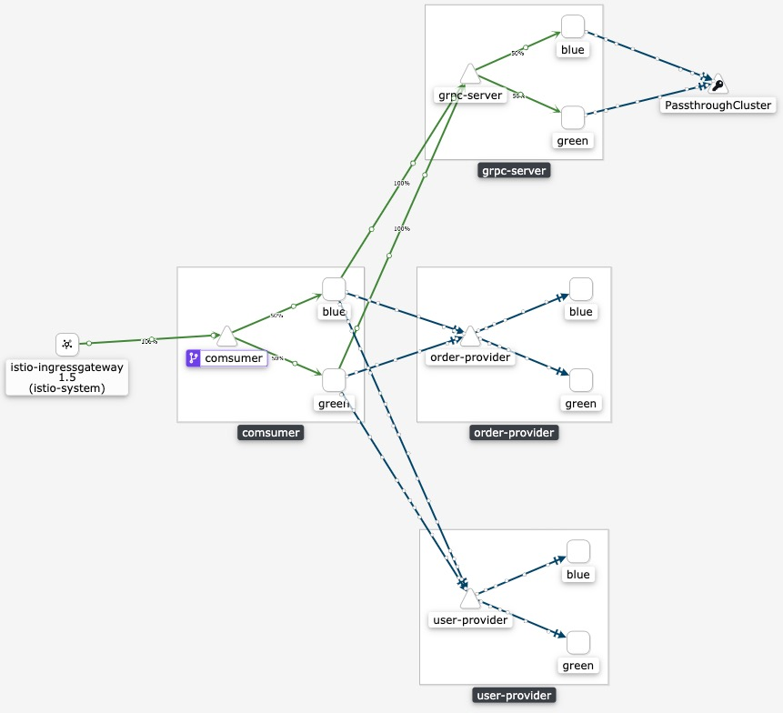

# mesh-demo 流程图
演示envoy代理Dubbo请求在内部服务之间调用流程，包含gRPC调用.

# 一.本地环境dubbo直连部署
## 环境准备

安装envoy环境

### macOS

~~~shell
$ brew tap tetratelabs/getenvoy
$ brew install envoy
$ envoy --version
~~~

### linux

~~~shell
$ sudo yum install -y yum-utils
$ sudo yum-config-manager --add-repo https://getenvoy.io/linux/centos/tetrate-getenvoy.repo
$ sudo yum-config-manager --enable tetrate-getenvoy-nightly
$ sudo yum install -y getenvoy-envoy
$ envoy --version
~~~

## 运行 order-provider

打开第一个终端设置运行需要的环境变量.

~~~shell
# order-provider server.yml 配置查看
$ cat $PWD/misc/order-provider/server.yml
...
services:
  "OrderProvider":
    protocol : "dubbo"
    interface : "com.k8s.Order.OrderProvider"
    methods:
      - name: "GetOrder"
      - name: "SetOrder"
protocols:
  "dubbo":
    name: "dubbo"
    port: 20001
...

# 运行 order-provider
$ export CONF_PROVIDER_FILE_PATH=$PWD/misc/order-provider/server.yml && export APP_LOG_CONF_FILE=$PWD/misc/order-provider/log.yml && go run $PWD/cmd/order-provider/main.go
...
2020-04-26T13:33:46.212+0800	INFO	Export service: dubbo://:20001/OrderProvider?accesslog=&app.version=0.0.1&application=mesh+demo&auth=&bean.name=OrderProvider&cluster=failover&environment=release&execute.limit=&execute.limit.rejected.handler=&group=&interface=com.k8s.Order.OrderProvider&loadbalance=random&methods.GetOrder.loadbalance=random&methods.GetOrder.retries=1&methods.GetOrder.tps.limit.interval=&methods.GetOrder.tps.limit.rate=&methods.GetOrder.tps.limit.strategy=&methods.GetOrder.weight=0&methods.SetOrder.loadbalance=random&methods.SetOrder.retries=1&methods.SetOrder.tps.limit.interval=&methods.SetOrder.tps.limit.rate=&methods.SetOrder.tps.limit.strategy=&methods.SetOrder.weight=0&module=mesh+demo+order+server&name=mesh+demo&organization=k8s.com&owner=ZX&param.sign=&registry.role=3&retries=&service.filter=echo%2Ctoken%2Caccesslog%2Ctps%2Cgeneric_service%2Cexecute%2Cpshutdown&timestamp=1587879226&tps.limit.interval=&tps.limit.rate=&tps.limit.rejected.handler=&tps.limit.strategy=&tps.limiter=&version=&warmup=100
2020-04-26T13:33:46.212+0800	DEBUG	s bind addr{:20001} ok!
...
~~~
## 运行 user-provider

~~~shell
# user-provider server.yml 配置查看
$ cat $PWD/misc/user-provider/server.yml
...
services:
  "UserProvider":
    protocol : "dubbo"
    interface : "com.k8s.User.UserProvider"
    loadbalance: "random"
    warmup: "100"
    cluster: "failover"
    methods:
      - name: "GetUser"
      - name: "SetUser"
protocols:
  "dubbo":
    name: "dubbo"
    port: 20000
...

# 运行 user-provider
$ export CONF_PROVIDER_FILE_PATH=$PWD/misc/user-provider/server.yml && export APP_LOG_CONF_FILE=$PWD/misc/user-provider/log.yml && go run $PWD/cmd/user-provider/main.go
...
2020-04-26T13:33:42.653+0800	INFO	Export service: dubbo://:20000/UserProvider?accesslog=&app.version=0.0.1&application=mesh+demo&auth=&bean.name=UserProvider&cluster=failover&environment=release&execute.limit=&execute.limit.rejected.handler=&group=&interface=com.k8s.User.UserProvider&loadbalance=random&methods.GetUser.loadbalance=random&methods.GetUser.retries=1&methods.GetUser.tps.limit.interval=&methods.GetUser.tps.limit.rate=&methods.GetUser.tps.limit.strategy=&methods.GetUser.weight=0&methods.SetUser.loadbalance=random&methods.SetUser.retries=1&methods.SetUser.tps.limit.interval=&methods.SetUser.tps.limit.rate=&methods.SetUser.tps.limit.strategy=&methods.SetUser.weight=0&module=mesh+demo+user+server&name=mesh+demo&organization=k8s.com&owner=ZX&param.sign=&registry.role=3&retries=&service.filter=echo%2Ctoken%2Caccesslog%2Ctps%2Cgeneric_service%2Cexecute%2Cpshutdown&timestamp=1587879222&tps.limit.interval=&tps.limit.rate=&tps.limit.rejected.handler=&tps.limit.strategy=&tps.limiter=&version=&warmup=100
2020-04-26T13:33:42.653+0800	DEBUG	s bind addr{:20000} ok!
...
~~~
## 运行 envoy proxy

打开第四个终端执行test.sh脚本运行envoy.

~~~shell
# envoy 配置
$ cat $PWD/manifests/envoy-org-config.yaml
...
static_resources:
  listeners:
  - name: listener_dubbo_8888
    address:
      socket_address:
        address: 0.0.0.0
        port_value: 8888
    filter_chains:
    - filters:
        - name: envoy.filters.network.dubbo_proxy
          typed_config:
            "@type": type.googleapis.com/envoy.config.filter.network.dubbo_proxy.v2alpha1.DubboProxy
            stat_prefix: dubbo_incomming_stats
            protocol_type: Dubbo
            serialization_type: Hessian2
            route_config:
              - name: local_route_user
                interface: UserProvider
                routes:
                  - match:
                      method:
                        name:
                          safe_regex:
                            google_re2: {}
                            regex: "(.*?)"
                    route:
                      cluster: user-provider
              - name: local_route_order
                interface: OrderProvider
                routes:
                  - match:
                      method:
                        name:
                          safe_regex:
                            google_re2: {}
                            regex: .*
                    route:
                      cluster: order-provider
            dubbo_filters:
              - name: envoy.filters.dubbo.router
  clusters:
  - name: user-provider
    connect_timeout: 1s
    hosts:
    - socket_address:
        address: 127.0.0.1
        port_value: 20000
  - name: order-provider
    connect_timeout: 1s
    hosts:
      - socket_address:
          address: 127.0.0.1
          port_value: 20001
...

# 启动脚本
$ ./test.sh
../proxy/bazel-bin/src/envoy/envoy -c ./manifests/envoy-org-config.yaml --drain-time-s 1 -l debug --concurrency 1 --base-id 40 --parent-shutdown-time-s 1 --restart-epoch 0
...
[2020-04-26 14:23:46.225][1533326][info][main] [external/envoy/source/server/server.cc:339] admin address: 0.0.0.0:19000
...
[2020-04-26 14:23:46.227][1533326][debug][upstream] [external/envoy/source/common/upstream/upstream_impl.cc:274] transport socket match, socket default selected for host with address 127.0.0.1:20000
[2020-04-26 14:23:46.228][1533326][debug][upstream] [external/envoy/source/common/upstream/upstream_impl.cc:274] transport socket match, socket default selected for host with address 127.0.0.1:20001
[2020-04-26 14:23:46.228][1533326][debug][upstream] [external/envoy/source/common/upstream/cluster_manager_impl.cc:922] adding TLS initial cluster order-provider
[2020-04-26 14:23:46.228][1533326][debug][upstream] [external/envoy/source/common/upstream/cluster_manager_impl.cc:922] adding TLS initial cluster user-provider
...
[2020-04-26 14:23:46.228][1533326][debug][config] [external/envoy/source/server/listener_manager_impl.cc:372] begin add/update listener: name=listener_dubbo_8888 hash=2181042276462869198
~~~

## 运行 consumer

打开第三个终端设置运行需要的环境变量.

~~~shell
$ cat $PWD/misc/consumer/client.yml
...
references:
  "UserProvider":
    interface : "com.k8s.User.UserProvider"
    cluster: "failover"
    url:  "dubbo://127.0.0.1:8888"
    methods :
      - name: "GetUser"
      - name: "SetUser"
  "OrderProvider":
    interface : "com.k8s.Order.OrderProvider"
    cluster: "failover"
    url:  "dubbo://127.0.0.1:8888"
    methods :
      - name: "GetOrder"
      - name: "SetOrder"
...

$ export CONF_CONSUMER_FILE_PATH=$PWD/misc/consumer/client.yml && export APP_LOG_CONF_FILE=$PWD/misc/consumer/log.yml && go run $PWD/cmd/consumer/main.go
...
2020-04-23T14:21:58.158+0800	INFO	Refer service: dubbo://127.0.0.1:8888/UserProvider?...
2020-04-23T14:21:58.158+0800	INFO	Refer service: dubbo://127.0.0.1:8888/OrderProvider?...
...
2020-04-23T14:21:58.158+0800	DEBUG	set method [GetOrder]
2020-04-23T14:21:58.158+0800	DEBUG	set method [SetOrder]
...
I0423 14:21:58.159031   87272 router.go:238] Listening on :8080, http://localhost:8080
~~~

## 测试
打开第五个终端发送请求.

~~~shell
# 对consumer发起GetUserDubbo请求
$ curl http://localhost:8090/GetUserDubbo
{
    "resultMap": {
        "id": 1,
        "name": "hello",
        "podName": "dubbo-local-user-xxx",
        "podNamespace": "admin",
        "podIp": "0.0.0.0",
        "service": "client",
        "type": "user",
        "time": "2020-04-26T14:28:52.224+08:00"
    },
    "success": true
}

# 观测 envoy 日志
...
[2020-04-26 14:28:52.217][1533332][debug][conn_handler] [external/envoy/source/server/connection_handler_impl.cc:353] [C0] new connection
[2020-04-26 14:28:52.218][1533332][debug][dubbo] [external/envoy/source/extensions/filters/network/dubbo_proxy/decoder.cc:95] dubbo decoder: 159 bytes available
[2020-04-26 14:28:52.218][1533332][debug][dubbo] [external/envoy/source/extensions/filters/network/dubbo_proxy/decoder.cc:105] dubbo decoder: protocol dubbo, state OnDecodeStreamHeader, 159 bytes available
[2020-04-26 14:28:52.218][1533332][debug][dubbo] [external/envoy/source/extensions/filters/network/dubbo_proxy/conn_manager.cc:82] dubbo: create the new decoder event handler
[2020-04-26 14:28:52.219][1533332][debug][dubbo] [external/envoy/source/extensions/filters/network/dubbo_proxy/router/route_matcher.cc:38] dubbo route matcher: weighted_clusters_size 0
[2020-04-26 14:28:52.219][1533332][debug][dubbo] [external/envoy/source/extensions/filters/network/dubbo_proxy/router/router_impl.cc:55] [C0][S4193721885415182561] dubbo router: cluster 'user-provider' match for interface 'UserProvider'
[2020-04-26 14:28:52.220][1533332][debug][dubbo] [external/envoy/source/extensions/filters/network/dubbo_proxy/router/router_impl.cc:77] [C0][S4193721885415182561] dubbo router: decoding request
[2020-04-26 14:28:52.220][1533332][debug][pool] [external/envoy/source/common/tcp/conn_pool.cc:83] creating a new connection
[2020-04-26 14:28:52.220][1533332][debug][pool] [external/envoy/source/common/tcp/conn_pool.cc:364] [C1] connecting
[2020-04-26 14:28:52.220][1533332][debug][connection] [external/envoy/source/common/network/connection_impl.cc:725] [C1] connecting to 127.0.0.1:20000

# 观测 envoy prometheus 监控指标
$ curl http://localhost:19000/stats/prometheus
...
# TYPE envoy_dubbo_dubbo_incomming_stats_cx_destroy_local_with_active_rq counter
envoy_dubbo_dubbo_incomming_stats_cx_destroy_local_with_active_rq{} 0
# TYPE envoy_dubbo_dubbo_incomming_stats_request_twoway counter
envoy_dubbo_dubbo_incomming_stats_request_twoway{} 21
# TYPE envoy_dubbo_dubbo_incomming_stats_local_response_business_exception counter
envoy_dubbo_dubbo_incomming_stats_local_response_business_exception{} 0
# TYPE envoy_dubbo_dubbo_incomming_stats_response_business_exception counter
envoy_dubbo_dubbo_incomming_stats_response_business_exception{} 0
# TYPE envoy_dubbo_dubbo_incomming_stats_response_error counter
envoy_dubbo_dubbo_incomming_stats_response_error{} 0
# TYPE envoy_dubbo_dubbo_incomming_stats_response_error_caused_connection_close counter
envoy_dubbo_dubbo_incomming_stats_response_error_caused_connection_close{} 0
# TYPE envoy_dubbo_dubbo_incomming_stats_request counter
envoy_dubbo_dubbo_incomming_stats_request{} 21
# TYPE envoy_dubbo_dubbo_incomming_stats_cx_destroy_remote_with_active_rq counter
envoy_dubbo_dubbo_incomming_stats_cx_destroy_remote_with_active_rq{} 0
# TYPE envoy_dubbo_dubbo_incomming_stats_response counter
envoy_dubbo_dubbo_incomming_stats_response{} 21
# TYPE envoy_dubbo_dubbo_incomming_stats_request_event counter
envoy_dubbo_dubbo_incomming_stats_request_event{} 136
# TYPE envoy_dubbo_dubbo_incomming_stats_response_decoding_success counter
envoy_dubbo_dubbo_incomming_stats_response_decoding_success{} 21
# TYPE envoy_dubbo_dubbo_incomming_stats_local_response_success counter
envoy_dubbo_dubbo_incomming_stats_local_response_success{} 0
# TYPE envoy_dubbo_dubbo_incomming_stats_response_success counter
envoy_dubbo_dubbo_incomming_stats_response_success{} 21
# TYPE envoy_dubbo_dubbo_incomming_stats_request_decoding_error counter
envoy_dubbo_dubbo_incomming_stats_request_decoding_error{} 0
# TYPE envoy_dubbo_dubbo_incomming_stats_request_oneway counter
envoy_dubbo_dubbo_incomming_stats_request_oneway{} 0
# TYPE envoy_dubbo_dubbo_incomming_stats_request_decoding_success counter
envoy_dubbo_dubbo_incomming_stats_request_decoding_success{} 21
# TYPE envoy_dubbo_dubbo_incomming_stats_local_response_error counter
envoy_dubbo_dubbo_incomming_stats_local_response_error{} 0
# TYPE envoy_dubbo_dubbo_incomming_stats_response_decoding_error counter
envoy_dubbo_dubbo_incomming_stats_response_decoding_error{} 0
# TYPE envoy_dubbo_dubbo_incomming_stats_request_active gauge
envoy_dubbo_dubbo_incomming_stats_request_active{} 0
# TYPE envoy_dubbo_dubbo_incomming_stats_request_time_ms histogram
envoy_dubbo_dubbo_incomming_stats_request_time_ms_bucket{le="0.5"} 14
envoy_dubbo_dubbo_incomming_stats_request_time_ms_bucket{le="1"} 14
envoy_dubbo_dubbo_incomming_stats_request_time_ms_bucket{le="5"} 20
envoy_dubbo_dubbo_incomming_stats_request_time_ms_bucket{le="10"} 21
envoy_dubbo_dubbo_incomming_stats_request_time_ms_bucket{le="25"} 21
envoy_dubbo_dubbo_incomming_stats_request_time_ms_bucket{le="50"} 21
envoy_dubbo_dubbo_incomming_stats_request_time_ms_bucket{le="100"} 21
envoy_dubbo_dubbo_incomming_stats_request_time_ms_bucket{le="250"} 21
envoy_dubbo_dubbo_incomming_stats_request_time_ms_bucket{le="500"} 21
envoy_dubbo_dubbo_incomming_stats_request_time_ms_bucket{le="1000"} 21
envoy_dubbo_dubbo_incomming_stats_request_time_ms_bucket{le="2500"} 21
envoy_dubbo_dubbo_incomming_stats_request_time_ms_bucket{le="5000"} 21
envoy_dubbo_dubbo_incomming_stats_request_time_ms_bucket{le="10000"} 21
envoy_dubbo_dubbo_incomming_stats_request_time_ms_bucket{le="30000"} 21
envoy_dubbo_dubbo_incomming_stats_request_time_ms_bucket{le="60000"} 21
envoy_dubbo_dubbo_incomming_stats_request_time_ms_bucket{le="300000"} 21
envoy_dubbo_dubbo_incomming_stats_request_time_ms_bucket{le="600000"} 21
envoy_dubbo_dubbo_incomming_stats_request_time_ms_bucket{le="1800000"} 21
envoy_dubbo_dubbo_incomming_stats_request_time_ms_bucket{le="3600000"} 21
envoy_dubbo_dubbo_incomming_stats_request_time_ms_bucket{le="+Inf"} 21
envoy_dubbo_dubbo_incomming_stats_request_time_ms_sum{} 17.3500000000000014210854715202
envoy_dubbo_dubbo_incomming_stats_request_time_ms_count{} 21
...
~~~

# 二. k8s容器部署
## 初始化

采用k8s 原生service 直连访问，代理采用流量透明劫持

~~~shell
# 编译打包
$ make push-provider
$ make push-grpc
$ make push-consumer

# comsumer 访问配置
...
    references:
      "UserProvider":
        interface : "com.k8s.User.UserProvider"
        cluster: "failover"
        url:  "dubbo://user-provider:20880"
        methods :
          - name: "GetUser"
          - name: "SetUser"
      "OrderProvider":
        interface : "com.k8s.Order.OrderProvider"
        cluster: "failover"
        url:  "dubbo://order-provider:20880"
        methods :
          - name: "GetOrder"
          - name: "SetOrder"
...

# 部署
$ kubectl apply -f manifests/demo-direct/ -n mesh-demo

# 查看运行状态
$ kubectl get pod -n mesh-demo
NAME                                    READY   STATUS    RESTARTS   AGE
comsumer-blue-655d76ddf4-b2mjc          2/2     Running   0          73s
comsumer-green-7598f8f5c7-xprkt         2/2     Running   0          73s
grpc-server-blue-6b898ff697-sqs52       2/2     Running   0          73s
grpc-server-green-84b486bfc8-qdx8q      2/2     Running   0          72s
order-provider-blue-76f57dd876-2k4bx    2/2     Running   0          72s
order-provider-green-7d766968dd-6cklv   2/2     Running   0          72s
user-provider-blue-7d5f86456c-mgkzf     2/2     Running   0          72s
user-provider-green-7c76466f64-hft6v    2/2     Running   0          72s

# 配置访问 ingressgateway
...
apiVersion: networking.istio.io/v1alpha3
kind: VirtualService
metadata:
  name: comsumer
spec:
  hosts:
    - "td.mesh.symcn.com"
  gateways:
    - istio-system/ingressgateway
  http:
    - route:
        - destination:
            host: comsumer
            port:
              name: http
              number: 80
...
$ kubectl apply -f manifests/demo-istio-rule.yaml -n mesh-demo

# 配置网关host后访问
10.16.247.4  td.mesh.symcn.com

$ curl http://td.mesh.symcn.com/
...
GET /version
GET /userhttp
GET /GetUserDubbo
GET /SetUserDubbo
GET /GetOrderDubbo
GET /SetOrderDubbo
GET /usergrpc
...

~~~

## 流量观测

# todo

- 使用pod内部127.0.0.1代理

  ~~~shell
  # dubbo 访问全部改为127.0.0.1访问
  ...
      references:
        "UserProvider":
          interface : "com.k8s.User.UserProvider"
          cluster: "failover"
          url:  "dubbo://127.0.0.1:20880"
          methods :
            - name: "GetUser"
            - name: "SetUser"
        "OrderProvider":
          interface : "com.k8s.Order.OrderProvider"
          cluster: "failover"
          url:  "dubbo://127.0.0.1:20880"
          methods :
            - name: "GetOrder"
            - name: "SetOrder"
  ...
  
  # listener 采用xds动态注入
  apiVersion: networking.istio.io/v1alpha3
  kind: EnvoyFilter
  metadata:
    name: local-dubbo-listener
    namespace: istio-system
  spec:
    workload_selector:
      labels:
        app: comsumer
    configPatches:
      - applyTo: LISTENER
        patch:
          operation: ADD
          value:
            name: local_proxy_20880
            address:
              socket_address:
                address: 0.0.0.0
                port_value: 20880
            trafficDirection: OUTBOUND
            filter_chains:
              - filters:
                  - name: envoy.filters.network.wasm
                    typedConfig:
  ...
                  - name: envoy.filters.network.dubbo_proxy
                    typed_config:
                      "@type": type.googleapis.com/envoy.config.filter.network.dubbo_proxy.v2alpha1.DubboProxy
                      stat_prefix: dubbo_incomming_stats
                      protocol_type: Dubbo
                      serialization_type: Hessian2
                      route_config:
                        - name: local_route_user
  ...
                              route:
                                cluster: outbound|20880||user-provider.mesh-demo.svc.cluster.local
                        - name: local_route_order
                          interface: OrderProvider
  ...
                              route:
                                cluster: outbound|20880||order-provider.mesh-demo.svc.cluster.local
                      dubbo_filters:
                        - name: envoy.filters.dubbo.router
  ~~~

- 服务发现采用 zk 或 nacos